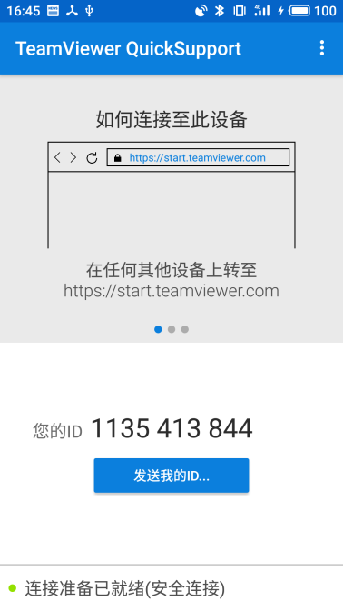
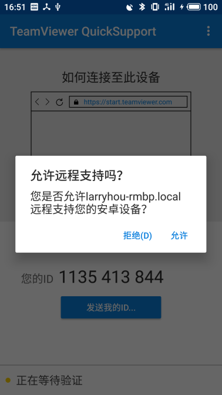

% ADB Tutorial
% LARRY HOU
% Jan 7, 2019

# ADB简介

- Android Debug Bridge
- 使用方法 `adb [command]`

<div style='font-size:18px' class="fragment">devices  |  help  |  version  |  connect  |  disconnect  |  bugreport | connect | devices | disable-verity | disconnect | emu | enable-verity | forward | get-devpath | get-serialno | get-state | help | install | install-multiple | jdwp | keygen | kill-server | logcat | ppp | pull | push | reboot | reconnect | remount | reverse | root | shell | sideload | start-server | sync | tcpip | uninstall | unroot | usb | version | wait-for[-TRANSPORT]-STATE
</div>

# 常用命令

logcat  |  shell  |   pull  |  push  |  install 

# adb logcat

# adb shell

# adb pull

# adb push

# 无线连接

- adb tcpip 5555
- 断开USB连接，并保持电脑和手机处于同一个WiFi网络
- adb connect [DEVICE_ADDRESS]:5555
- 执行各种adb命令
- adb usb 恢复USB连接

# 设备选择

```
$ adb devices -l
List of devices attached
721QECRK2TCHA          device usb:336658432X product:meizu_M6Note_CN model:M6_Note device:M6Note transport_id:5
d5e5e93a               device usb:336855040X product:PBFM00 model:PBFM00 device:PBFM00 transport_id:4
```

```
# 选择设备
$ adb -s 721QECRK2TCHA shell
M6Note:/ $ 

# 更换设备
$ adb -s d5e5e93a shell
PBFM00:/ $ 
```

# 远程桌面

- TeamViewer


# 

<table>
	<tr>
		<td></td>
		<td></td>
	</tr>
</table>

# Q&A
