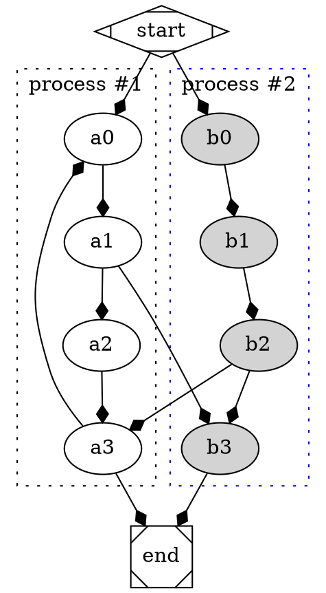

% Graphviz Tutorial
% LARRY HOU
% Fri Nov 16, 2018

## 概览

### 弧线连接
<table width="100%" height="100%"><tr><td style="vertical-align:top">
```dot
digraph{
    bgcolor=transparent;
	main -> parse -> execute;
	main -> init;
	main -> cleanup;
	execute -> make_string;
	execute -> printf
	init -> make_string;
	main -> printf;
	execute -> compare;
}
```
</td><td style="vertical-align:middle"></td></tr></table>

<div class="fragment">
```bash
dot g.dot -Tsvg -o g.svg
```
</div>

### 折线连接
<table width="100%" height="100%"><tr><td style="vertical-align:top">
```dot
digraph{
	bgcolor=transparent;
	splines=polyline;
	main -> parse -> execute;
	main -> init;
	main -> cleanup;
	execute -> make_string;
	execute -> printf
	init -> make_string;
	main -> printf;
	execute -> compare;
}
```
</td><td style="vertical-align:middle"></td></tr></table>

### 箭头样式
<table width="100%" height="100%"><tr><td style="vertical-align:top">
```dot
digraph{
	bgcolor=transparent;
	splines=polyline;
	edge[arrowhead=vee];
	main -> parse -> execute;
	main -> init;
	main -> cleanup;
	execute -> make_string;
	execute -> printf
	init -> make_string;
	main -> printf;
	execute -> compare;
}
```
</td><td style="vertical-align:middle"></td></tr></table>

### 左右排版
<table width="100%" height="100%"><tr><td style="vertical-align:top">
```dot
digraph{
	bgcolor=transparent;
	splines=polyline;
	rankdir=LR;
	edge[arrowhead=vee];
	main -> parse -> execute;
	main -> init;
	main -> cleanup;
	execute -> make_string;
	execute -> printf
	init -> make_string;
	main -> printf;
	execute -> compare;
}
```
</td><td style="vertical-align:middle"></td></tr></table>

### 下上排版
<table width="100%" height="100%"><tr><td style="vertical-align:top">
```dot
digraph{
	bgcolor=transparent;
	splines=polyline;
	rankdir=BT;
	edge[arrowhead=vee];
	main -> parse -> execute;
	main -> init;
	main -> cleanup;
	execute -> make_string;
	execute -> printf
	init -> make_string;
	main -> printf;
	execute -> compare;
}
```
</td><td style="vertical-align:middle"></td></tr></table>

### 节点形状
<table width="100%" height="100%"><tr><td style="vertical-align:top">
```dot
digraph{
	bgcolor=transparent;
	splines=polyline;
	edge[arrowhead=vee];
	node[shape=note];
	main -> parse -> execute;
	main -> init;
	main -> cleanup;
	execute -> make_string;
	execute -> printf
	init -> make_string;
	main -> printf;
	execute -> compare;
}
```
</td><td style="vertical-align:middle"></td></tr></table>

## 图形/Graph

### 图形定义

<div style="font-size:30px;">图形脚本是个文本文件，`digraph`后面紧跟图形引用名，然后`{}`里面定义图形内容</div>

```dot
digraph {
}
```

### 嵌套图形

```dot
digraph 
{
    subgraph subgraph_name {

    }
}
```

### 复合图形

<div style="font-size:30px;">在复合图形里面设置属性`compound`，然后可以把嵌套图形作为整体来连接</div>
<table width="100%" height="100%"><tr><td style="vertical-align:top">
```dot
digraph
{
	bgcolor=transparent;
    compound=true;
    subgraph cluster0 
	{
      a -> b;
      a -> c;
      b -> d;
      c -> d;
    }
    subgraph cluster1 
	{
		e -> g;
		e -> f; 
	}
    b -> f [lhead=cluster1];
    d -> e;
    c -> g [ltail=cluster0, lhead=cluster1];
    c -> e [ltail=cluster0];
	d -> h;
}
```
</td><td></td></tr></table>

### 图形属性

<div style="font-size:30px;">前面用到的`bgcolor`/`compound`/`splines`等都是图形属性</div>
```dot
digraph
{
	bgcolor=transparent;
    compound=true;
}
```

<div style="font-size:30px;">也可以把图形属性设置放到`graph[]`里面</div>
```dot
digraph
{
    graph[bgcolor=transparent, compound=true]
}
```

<div style="font-size:30px;">[更多属性设置](https://graphviz.gitlab.io/_pages/pdf/dotguide.pdf)</div>

## 节点/Node

### 节点形状
<div style="font-size:30px;">流程图的每个节点都一个形状</div>

<div style="overflow: auto;max-height: 450px">
<table width="100%" height="100%">
    <tr>
        <td style="text-align: center;"></td>
        <td style="text-align: center;"></td>
        <td style="text-align: center;"></td>
        <td style="text-align: center;"></td>
    </tr>
    <tr>
        <td style="text-align: center;"></td>
        <td style="text-align: center;"></td>
        <td style="text-align: center;"></td>
        <td style="text-align: center;"></td>
    </tr>
    <tr>
        <td style="text-align: center;"></td>
        <td style="text-align: center;"></td>
        <td style="text-align: center;"></td>
        <td style="text-align: center;"></td>
    </tr>
    <tr>
        <td style="text-align: center;"></td>
        <td style="text-align: center;"></td>
        <td style="text-align: center;"></td>
        <td style="text-align: center;"></td>
    </tr>
    <tr>
        <td style="text-align: center;"></td>
        <td style="text-align: center;"></td>
        <td style="text-align: center;"></td>
        <td style="text-align: center;"></td>
    </tr>
    <tr>
        <td style="text-align: center;"></td>
        <td style="text-align: center;"></td>
        <td style="text-align: center;"></td>
        <td style="text-align: center;"></td>
    </tr>
    <tr>
        <td style="text-align: center;"></td>
        <td style="text-align: center;"></td>
        <td style="text-align: center;"></td>
        <td style="text-align: center;"></td>
    </tr>
    <tr>
        <td style="text-align: center;"></td>
        <td style="text-align: center;"></td>
        <td style="text-align: center;"></td>
        <td style="text-align: center;"></td>
    </tr>
    <tr>
        <td style="text-align: center;"></td>
        <td style="text-align: center;"></td>
        <td style="text-align: center;"></td>
        <td style="text-align: center;"></td>
    </tr>
    <tr>
        <td style="text-align: center;"></td>
        <td style="text-align: center;"></td>
        <td style="text-align: center;"></td>
        <td style="text-align: center;"></td>
    </tr>
    <tr>
        <td style="text-align: center;"></td>
        <td style="text-align: center;"></td>
        <td style="text-align: center;"></td>
        <td style="text-align: center;"></td>
    </tr>
    <tr>
        <td style="text-align: center;"></td>
        <td style="text-align: center;"></td>
        <td style="text-align: center;"></td>
        <td style="text-align: center;"></td>
    </tr>
    <tr>
        <td style="text-align: center;"></td>
        <td style="text-align: center;"></td>
        <td style="text-align: center;"></td>
        <td style="text-align: center;"></td>
    </tr>
    <tr>
        <td style="text-align: center;"></td>
        <td style="text-align: center;"></td>
        <td style="text-align: center;"></td>
        <td style="text-align: center;"></td>
    </tr>
    <tr>
        <td style="text-align: center;"></td>
        <td style="text-align: center;"></td>
        <td style="text-align: center;"></td>
    </tr>
</table>
</div>

### 定制多边形

<table width="100%" height="100%"><tr><td style="vertical-align:top">
```dot
digraph {
	bgcolor=transparent;
	g1[shape=polygon, sides=5, regular=true]
	g2[shape=polygon, sides=5, regular=true]
	g3[shape=polygon, sides=5, regular=true, peripheries=2]
	g4[shape=polygon, sides=5, regular=true, peripheries=3]
	g5[shape=polygon, sides=5, regular=true, peripheries=4]
	g6[shape=polygon, sides=6, regular=true, peripheries=2]
	g7[shape=polygon, sides=7, regular=true]
	g8[shape=polygon, sides=8, regular=true]
	g9[shape=polygon, sides=9, regular=true]
	g10[shape=polygon, sides=10, regular=true, peripheries=6]
	a1[shape=polygon, sides=4, distortion=0.5]
	a2[shape=polygon, sides=4, skew=0.5]
	g1 -> {g2,g3,g4,g5}
	g3 -> {g6, g7}
	g6 -> {g8, g9, g10}
	g7 -> a1 -> a2;
}
```
</td><td style="vertical-align:middle"></td></tr></table>

### 连接方位

<table width="100%" height="100%"><tr><td style="vertical-align:top">
```dot
digraph
{
	bgcolor=transparent;
	edge[arrowhead=vee];
	node[shape=note, tailport=n];
	main -> parse -> execute;
	main:se -> init:n;
	main -> cleanup;
	execute -> make_string[tailport=sw];
	execute -> printf[tailport=nw, headport=nw]
	init:e -> make_string:e;
	main -> printf[headport=s];
	execute -> compare;
}
```
</td><td style="vertical-align:middle"></td></tr></table>

### 表格图形

<table width="100%" height="100%"><tr><td style="vertical-align:top">
```dot
digraph 
{
	bgcolor=transparent;
	node [shape=record];
	struct1 [shape=record, 
		label="<f0> left|<f1> mid\ dle|<f2> right"];
	struct2 [shape=record,
		label="<f0> one|<f1> two"];
	struct3 [shape=record,
		label="hello\nworld |{ b |{c|<here> d|e}| f}| g | h"];
	struct1 -> struct2;
	struct1 -> struct3;
 }
```
</td><td style="vertical-align:middle"></td></tr></table>

### 排列规则

<div style="font-size:30px">node属性设置shape=record，同时label属性里面添加竖线`|`分割的单元格，使用花括号`{}`可以增加嵌套表格，默认为横排，奇数次嵌套表示竖排，偶数次嵌套表示横排</div>

<table width="100%" height="100%"><tr><td style="vertical-align:top">
```dot
digraph 
{
	bgcolor=transparent;
	node [shape=record, 
        fontname="Fira Code"];
	table [shape=record,
        label="0|{1|{2|{3|{4|{5|{6|{7|{8|
        {9|A|B}|C}|D}|E}|F}|G}|H}|I}|J}|K"];
}
```
</td><td style="vertical-align:middle"></td></tr></table>


### 表格锚点 1/3

<table width="100%" height="100%"><tr><td style="vertical-align:top">
```dot
digraph
{
	bgcolor=transparent;
	node [shape = record,height=.1];
	node0[label = "<f0> |<f1> G|<f2> "];
	node1[label = "<f0> |<f1> E|<f2> "];
	node2[label = "<f0> |<f1> B|<f2> "];
	node3[label = "<f0> |<f1> F|<f2> "];
	node4[label = "<f0> |<f1> R|<f2> "];
	node5[label = "<f0> |<f1> H|<f2> "];
	node6[label = "<f0> |<f1> Y|<f2> "];
	node7[label = "<f0> |<f1> A|<f2> "];
	node8[label = "<f0> |<f1> C|<f2> "];
	"node0":f2 -> "node4":f1;
	"node0":f0 -> "node1":f1;
	"node1":f0 -> "node2":f1;
	"node1":f2 -> "node3":f1;
	"node2":f2 -> "node8":f1;
	"node2":f0 -> "node7":f1;
	"node4":f2 -> "node6":f1;
	"node4":f0 -> "node5":f1;
}
```
</td><td style="vertical-align:middle"></td></tr></table>

### 表格锚点 2/3

<table width="100%" height="100%"><tr><td style="vertical-align:top">
```dot
digraph 
{
	bgcolor=transparent;
	node [shape=record];
	struct1 [shape=record,
        label="<f0> left|<f1> middle|<f2> right"];
	struct2 [shape=record,
        label="<f0> one|<f1> two"];
	struct3 [shape=record,
        label="hello\nworld |{ b |{c|<here> d|e}| f}| g | h"];
	struct1:f1 -> struct2:f0;
	struct1:f2 -> struct3:here;
}
```
</td><td style="vertical-align:middle"></td></tr></table>

### 表格锚点 3/3

<table width="100%" height="100%"><tr><td style="vertical-align:top">
```dot
digraph
{
	bgcolor=transparent;
	nodesep=.05;
	rankdir=LR;
	node [shape=record,width=.1,height=.1];

	node0 [label = 
        "<f0> |<f1> |<f2> |<f3> |<f4> |<f5> |<f6> | ",
        height=2.5];
	node [width = 1.5];
	node1 [label = "{<n> n14 | 719 |<p> }"];
	node2 [label = "{<n> a1  | 805 |<p> }"];
	node3 [label = "{<n> i9  | 718 |<p> }"];
	node4 [label = "{<n> e5  | 989 |<p> }"];
	node5 [label = "{<n> t20|959|<p>}"];
	node6 [label = "{<n> o15|794|<p>}"];
	node7 [label = "{<n> s19|659|<p>}"];
	
	node0:f0 -> node1:n;
	node0:f1 -> node2:n;
	node0:f2 -> node3:n;
	node0:f5 -> node4:n;
	node0:f6 -> node5:n;
	node2:p -> node6:n;
	node4:p -> node7:n;
 }

```
</td><td style="vertical-align:middle"></td></tr></table>


### 设置样式

<div style="font-size:30px;">类似图形属性，节点属性设置放到`node[]`里面</div>

<table width="100%" height="100%"><tr><td style="vertical-align:top">
```dot
digraph
{
	bgcolor=transparent;
    compound=true;
	node[shape=octagon]
    subgraph cluster0 
	{
      a -> b;
      a -> c;
      b -> d;
      c -> d;
    }
    subgraph cluster1 
	{
		e -> g;
		e -> f; 
	}
    b -> f [lhead=cluster1];
    d -> e;
    c -> g [ltail=cluster0, lhead=cluster1];
    c -> e [ltail=cluster0];
	d -> h;
}
```
</td><td style="vertical-align:middle"></td></tr></table>

<div style="font-size:30px;">[更多属性设置](https://graphviz.gitlab.io/_pages/pdf/dotguide.pdf)</div>

### 节点属性

- `node[]`定义的属性影响之后的节点属性
- 单个节点后添加方括号`[]`可以覆盖覆盖`node`定义的属性
- `node[]`属性可以重复出现，后定义的属性覆盖之前的属性

## 线条/Edge

### 箭头样式

<div style="overflow: auto;max-height: 450px">
<table width="100%" height="100%">
    <tr>
        <td style="text-align: center;"></td>
        <td style="text-align: center;"></td>
        <td style="text-align: center;"></td>
        <td style="text-align: center;"></td>
    </tr>
    <tr>
        <td style="text-align: center;"></td>
        <td style="text-align: center;"></td>
        <td style="text-align: center;"></td>
        <td style="text-align: center;"></td>
    </tr>
    <tr>
        <td style="text-align: center;"></td>
        <td style="text-align: center;"></td>
        <td style="text-align: center;"></td>
        <td style="text-align: center;"></td>
    </tr>
    <tr>
        <td style="text-align: center;"></td>
        <td style="text-align: center;"></td>
        <td style="text-align: center;"></td>
        <td style="text-align: center;"></td>
    </tr>
    <tr>
        <td style="text-align: center;"></td>
        <td style="text-align: center;"></td>
        <td style="text-align: center;"></td>
        <td style="text-align: center;"></td>
    </tr>
    <tr>
        <td style="text-align: center;"></td>
        <td style="text-align: center;"></td>
        <td style="text-align: center;"></td>
        <td style="text-align: center;"></td>
    </tr>
    <tr>
        <td style="text-align: center;"></td>
        <td style="text-align: center;"></td>
        <td style="text-align: center;"></td>
        <td style="text-align: center;"></td>
    </tr>
    <tr>
        <td style="text-align: center;"></td>
        <td style="text-align: center;"></td>
        <td style="text-align: center;"></td>
        <td style="text-align: center;"></td>
    </tr>
</table>
</div>

### 线条属性

<div style="font-size:30px;">线条属性设置放到`edge[]`里面</div>

<table width="100%" height="100%"><tr><td style="vertical-align:top">

</td><td style="vertical-align:middle"></td></tr></table>

<div style="font-size:30px;">[更多属性设置](https://graphviz.gitlab.io/_pages/pdf/dotguide.pdf)</div>


